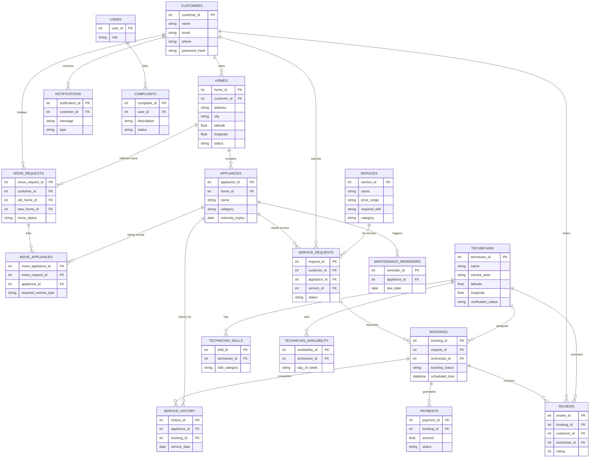

# Asif – Phase 1 Requirements

## 1. Customer Requirements

The Customer module allows a registered user to manage their account and interact with the home-service system.

### Functional Requirements

* Customer should be able to register using name, email, phone number, and password.
* Customer should be able to log in securely.
* Customer should be able to view and update their profile (name, phone, email, address).
* Customer should be able to reset or change their password.
* Customer should be able to view their dashboard (homes, appliances, bookings, service history).
* Customer should be able to log out.
* Customer should be able to delete or deactivate their account.

### Customer Information

A customer profile should contain:

* Customer ID
* Name
* Email
* Phone number
* Password (hashed)
* Registered date
* Account status (active/inactive)

---

## 2. Home Requirements

The Home module allows a customer to manage one or more residences linked to their account.

### Functional Requirements

* Customer should be able to add a new home.
* Customer should be able to view a list of all their homes.
* Customer should be able to view details of a specific home.
* Customer should be able to edit home details.
* Customer should be able to delete a home.
* Customer should be able to mark a home as the "current" home.
* Customer should be able to switch between multiple homes.
* System should support multiple homes per customer.

### Home Information

A home record should contain:

* Home ID
* Customer ID
* Address
* City
* State
* Pincode
* Latitude
* Longitude
* Home type (owned/rented/other)
* Current/previous status
* Created date

---

## 3. Appliance Requirements

The Appliance module allows a customer to maintain a digital record of appliances within each home.

### Functional Requirements

* Customer should be able to add an appliance to a home.
* Customer should be able to view a list of appliances for a home.
* Customer should be able to view details of a specific appliance.
* Customer should be able to edit appliance details.
* Customer should be able to delete an appliance.
* Customer should be able to record warranty information for an appliance.
* System should link each appliance to a home and, where applicable, to relevant services.
* System should support common appliance categories.

### Appliance Categories

* Fans
* Lights
* AC
* Refrigerator
* Washing machine
* TV
* Geyser
* RO purifier
* Microwave
* Inverter
* Other

### Appliance Information

An appliance record should contain:

* Appliance ID
* Home ID
* Name
* Category
* Brand
* Model
* Purchase date
* Warranty expiry date
* Created date

---

## 4. Move Mode Requirements

The Move Mode module helps a customer relocate their appliances to a new home and arrange installation/removal services.

### Functional Requirements

* Customer should be able to initiate "Move to New Home."
* Customer should be able to enter the new home's address details.
* Customer should be able to select which appliances to transfer from the old home.
* Customer should be able to view the list of required services generated for the selected appliances (handled by Member 3, using appliance data provided by Asif).
* Customer should be able to view an estimated cost range for the move (handled by Member 3).
* Customer should be able to confirm and submit the move request.
* Customer should be able to track the status of the move request.
* System should create a new home record for the destination address once the move is confirmed.
* System should preserve appliance history when appliances are transferred to the new home.

### Move Request Information

A move request should contain:

* Move request ID
* Customer ID
* Old home ID
* New home ID
* List of appliances being moved
* Move status (Pending, In Progress, Completed, Cancelled)
* Created date

### Move Appliance Information

Each moved appliance record should contain:

* Move appliance ID
* Move request ID
* Appliance ID
* Required service type (e.g., removal, installation)

---

## 5. Services Requirements

The Services module defines the catalog of home services the platform offers.

### Functional Requirements

* System should maintain a catalog of available services.
* Each service should have a name, description, estimated price/range, required skill, and estimated duration.
* Customer should be able to browse the service catalog.
* Customer should be able to view details of a specific service.
* System should associate services with relevant appliance categories where applicable.

### Initial Service Categories

* Electrical
* Plumbing
* AC Service
* Appliance Repair
* Carpentry
* Painting
* Cleaning
* RO Service
* Geyser Service
* Installation

### Service Information

A service record should contain:

* Service ID
* Name
* Description
* Estimated price / price range
* Required skill
* Estimated duration
* Category

---

## 6. Technician Requirements

The Technician module manages technician registration, profile, and availability.

### Functional Requirements

* Technician should be able to register using name, email, phone number, and password.
* Technician should be able to log in securely.
* Technician should be able to create and update a profile.
* Technician should be able to add skills and areas of expertise.
* Technician should be able to set service area / location.
* Technician should be able to set availability (days/times).
* Technician should be able to view assigned bookings (data supplied to Member 3's booking flow).
* System should calculate and display a technician's average rating (rating value supplied by Member 3's Reviews module).
* Admin should be able to verify technician registrations (verification action handled by Member 3, using data provided here).

### Technician Information

A technician profile should contain:

* Technician ID
* Name
* Email
* Phone number
* Password (hashed)
* Service area / location
* Latitude
* Longitude
* Verification status
* Registered date

### Technician Skill Information

A technician skill record should contain:

* Skill ID
* Technician ID
* Skill/service category
* Years of experience

### Technician Availability Information

An availability record should contain:

* Availability ID
* Technician ID
* Day of week
* Start time
* End time
* Available (yes/no)

---

# Overall Requirement Flow

**Customer registers/logs in**
↓
**Customer adds home(s) and appliance(s)**
↓
**Customer browses service catalog / technician profiles**
↓
**Customer requests a service or initiates Move Mode**
↓
**Appliance and service data is passed to Nearby Matching (Member 3)**
↓
**Technician receives and accepts the request (Member 3's Booking module)**
↓
**Service is completed and history is recorded**
↓
**Customer views updated home/appliance profile and service history**

# Phase 1 Deliverable

Asif is responsible for preparing the requirements for:

* Customer
* Home
* Appliance
* Move Mode
* Services
* Technicians

**Phase 1 does not require backend coding or frontend coding.**

These requirements will be used in the next phases for:

* Database design
* Backend development
* Frontend development
* Integration
* Testing
  
# HomeService OS — Phase 1: Requirements & Planning
## All 4 Together — Objective, Roles, ER Diagram, Database Design, Wireframes

This is the shared team output for Phase 1, sitting alongside each member's individual requirements docs (Asif's — Customer/Home/Appliance/Move Mode/Services/Technicians — is already on GitHub).

---

## 1. Project Objective

HomeService OS is a platform for managing home services, appliances, maintenance, technicians, bookings, expenses, and relocation/reinstallation. The system keeps a digital history of each home and its appliances, and is built to later support an AI agent layer.

**Core product flow:**
```
Customer → Home → Appliances → Maintenance → Service Request → Technician
   → Booking → Service → Payment → Service History
```

**Move flow:**
```
Old Home → New Home → Transfer Appliances → Identify Required Services
   → Find Nearby Technicians → Book → Complete Installation
```

**Tech stack:** HTML, CSS, JavaScript, Python Flask, MySQL, MySQL Workbench. AI agent is a later phase, added only once the core product is stable.

---

## 2. Roles

### User roles (in the product)
| Role | Capabilities |
|---|---|
| Customer | Register/login, manage homes & appliances, request services, find nearby technicians, book, track status, view history/expenses/reminders, rate, use Move Mode |
| Technician | Register, build profile, add skills, set location/availability, receive/accept requests, update jobs, record work & charges, view earnings/ratings |
| Admin | Manage customers, technicians, services, bookings, complaints, payments, platform analytics |

### Team roles (who builds what)
| Member | Main Responsibility | Modules |
|---|---|---|
| Member 1 (Asif) | Customer & Home — Backend & Database | Customer, Home, Appliances, Move Mode, Services, Technicians |
| Member 2 | Services & Technicians — Frontend UI/UX | Services UI, Technician UI, Booking UI, Nearby Matching UI |
| Member 3 | Admin & Analytics — Backend & Database | Admin, Statistics, Payments, Reviews, Notifications, Booking, Matching |
| Member 4 | Frontend UI/UX — Design System | Customer/Home/Appliance UI, Move Mode UI, Admin/Statistics UI, shared design system |

Team rule: Member 1 & Member 3 own all backend/Python/database work between them. Member 2 & Member 4 own all frontend HTML/CSS/JS work between them. Phases 1, 15–17 (integration, testing, deployment) are done together.

---

## 3. Full ER Diagram (whole system)



---

## 4. Database Design Summary

**Owned by Member 1 (Asif):** `customers`, `homes`, `appliances`, `move_requests`, `move_appliances`, `technicians`, `services`, `technician_skills`, `technician_availability`

**Owned by Member 3:** `users`, `payments`, `reviews`, `complaints`, `notifications`, `maintenance_reminders`, `service_requests`, `bookings`, `service_history`

**Shared work (all 4):** finalize foreign keys and relationships above, create the MySQL database in Workbench, agree on naming conventions, load test/seed data (e.g. the 10 initial service categories, a few sample technicians and homes).

**Key relationships to lock down together:**
- `service_requests.appliance_id` → `appliances.appliance_id`
- `bookings.technician_id` → `technicians.technician_id`
- `bookings.request_id` → `service_requests.request_id`
- `service_history.booking_id` → `bookings.booking_id`
- `move_appliances.appliance_id` → `appliances.appliance_id`

---

## 5. Wireframes / Page List (whole system)

| Section | Pages | Built by |
|---|---|---|
| Auth | Register, Login (customer + technician), Admin login | Member 2 & 4 |
| Customer | Dashboard, Profile/Settings | Member 4 |
| Home | Home list, Home detail/add/edit | Member 4 |
| Appliance | Appliance list, Appliance detail/add/edit | Member 4 |
| Move Mode | Start, New address, Select appliances, Review/confirm, Status tracker | Member 2 + 4 (split, see Phase 6) |
| Services | Catalog, Service detail | Member 2 |
| Technicians | Register/login, Profile, Listing/search | Member 2 |
| Booking | Request wizard, Status tracker | Member 2 |
| Nearby Matching | Technician list/map view | Member 2 |
| Payments & Reviews | Payment summary, Rating/review form | Member 2 |
| Admin | Dashboard (customers/technicians/services/bookings/complaints) | Member 4 |
| Statistics | Customer/technician/admin analytics dashboards | Member 2 (services/booking side) + Member 4 (customer/admin side) |

**Shared design system (owned by Member 4, used by everyone):** colors, typography, buttons, cards, forms, modals, alerts, navbar, sidebar, footer.

---

## 6. Phase 1 Sign-off Checklist (for all 4 to confirm together)

- [ ] Objective and scope agreed
- [ ] Roles and module ownership confirmed
- [ ] Full ER diagram reviewed by all 4
- [ ] Database table list and foreign keys agreed
- [ ] Wireframe/page list agreed
- [ ] GitHub repo structure and branch strategy set
- [ ] Each member's individual Phase 1 requirements doc pushed to GitHub

Once this is signed off, the team moves to **Phase 2 — System Design** (detailed flows + wireframes per module).
